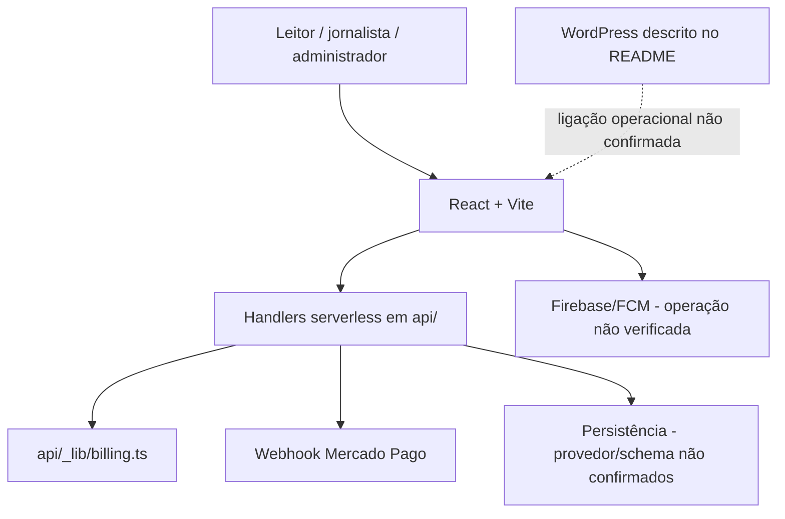
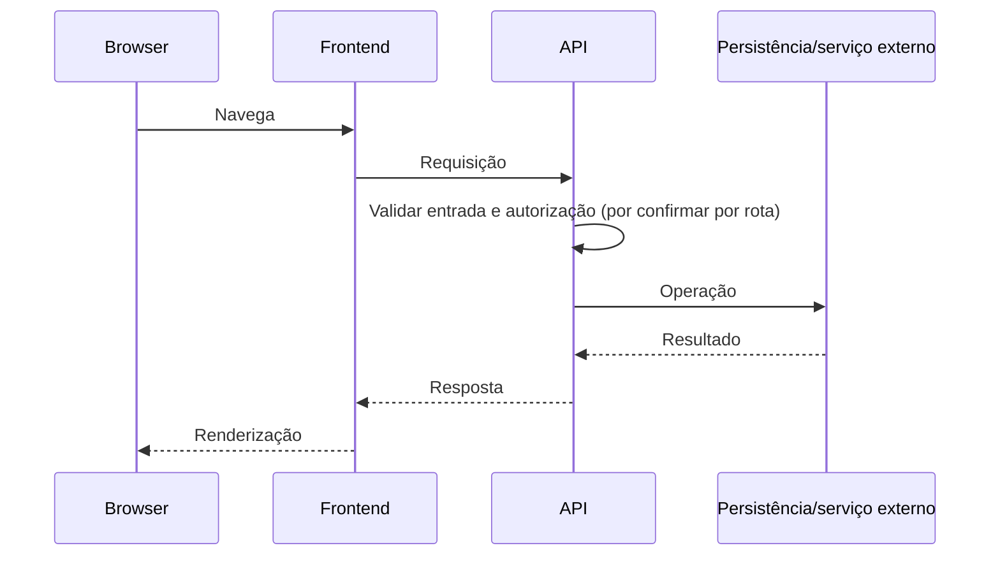

# Arquitetura observada

## Camadas
- Interface: `src/App.tsx`, `src/components/`, `public/`.
- API: `api/[...path].ts`, `checkout.ts`, `plans.ts`, `donation.ts`, `contact-submissions.ts`, `privacy-requests.ts`, `webhooks/mercadopago.ts`.
- Lógica de cobrança: `api/_lib/billing.ts`.
- Configuração: `.env.example`, `package.json`, `.github/workflows/validate.yml`.
- WordPress: o README descreve tema FSE e plugin editorial; a instalação real e a comunicação com a API precisam ser confirmadas.

## Fluxo HTTP conceitual

O diagrama mostra camadas identificadas, não prova que todos os serviços estão conectados.
